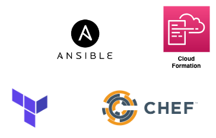

## Infrastructure as Code
TerraformはInfrastructure as Codeのアプローチを行うためのツールです。  

Infrastructure as Code はその名前の通り、「インフラのコード化」のためのアプローチです。  
構成を **宣言的** に記述することによって **コードベースでインフラの管理** を行うとができ、属人化を防ぐことができます。  
また、コードベースで管理することにより **インフラのバージョン管理** が可能かつ、そのコードを読むことで現在の構成を一覧することも可能です。

## AWSとTerraform

TerraformはInfrastructure as Codeのためのツールです。  
例えば上の図のようなVPC・ALB・ECS・etc...のような復数のサービスと、その依存関係をコードで記述し、AWS上へ展開することが可能です。

## IaCツールの選択肢

他にもInfrastructure as Codeを実現するためのツールとしてAnsible, Chef, CloudFormationなど様々なツールが存在します。  
それぞれのツールは実現したいことや得意なユースケースが異なるので、それらを把握して使い分けると良いでしょう。

### Terraform
このハンズオンで取り扱うツールです。

Hashicorp社（VagrantやVaultなどが代表的。）が開発したOSSのInfrastructure as Codeツールです。  
RubyライクなHCLというDSLでコードを記述します。

また、TerraformはAWS専用のツールではありません。  
AWS以外のクラウドであるGCPやAzureでも使用でき、他にもDatadogやHerokuなどの管理を行うことが可能です。  

[Providers - Terraform by HashiCorp](https://www.terraform.io/docs/providers/)

### CloudFormation
AWSによるAWSのためのAWSのInfrastructure as Codeツール。

AWSが開発していることもあり、AWSに特化していることが特徴です。  
JSONもしくはyamlでコードを記述します。

CloudFormationはAWSの1つのサービスなので、ステータスの管理・並列実行・コンフリクトの防止など、煩わしい面をAWS側で行ってくれます。  
また、AWSが出すリファレンスアーキテクチャはCloudFormationで記載されていることが多いため、AWSを使う場合は書けなくても読めることが望ましいと筆者は考えています。

### Ansible
TerraformとCloudFormationは「AWSの構成管理」を責務としていますが、Ansibleその2つとは毛色が違い「OSより上の構成管理」を主に責務としています。  
例えば、「どのミドルウェアやコードをインストールして、どのマシンへプロビジョニングする」といったこと行います。  

そのためクラウドとDockerを使うと使用する機会が少ないです。  
Infrastructure as Codeと一概に言っても様々な責務があるということを伝えたかったため、Ansibleの紹介をしました。  

!!! note "で、何を使えば良いわけ？"
    インフラの構成管理はAWSの場合であればTerraformとCloudFormation、どちらを使用しても問題ないでしょう。  
    AWS以外にGCP・Azure・Datadog・PagerDutyなどの様々なプロバイダーをコード化したいという要求がある/予想できるのであればAWS専用のCloudFormationではなくTerraformが選択されます。  
    また、AnsibleのようなOSより上の構成管理のモチベーションがある場合は、そもそもDockerとコンテナオーケストレーションツールを使用し、Ansible(やChef)のようなInfrastructure as Codeを使用する余地を与えないことが望ましいと筆者は考えます。もちろん、ベアメタルやVMでないと実現できないケースも存在するのでその場合はAnsibleのようなツールを使用しましょう。  
    結論、「クラウドはTerraform、アプリはDocker」を使用することをオススメします。
