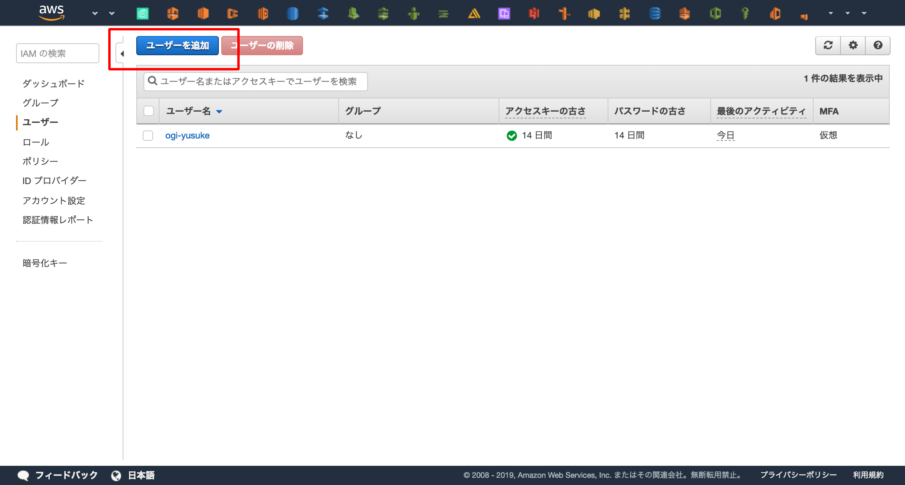
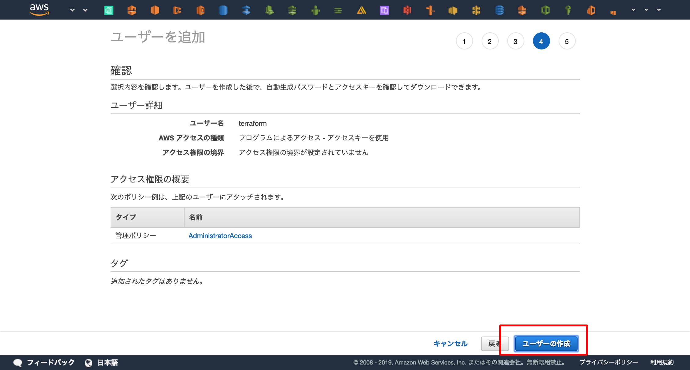
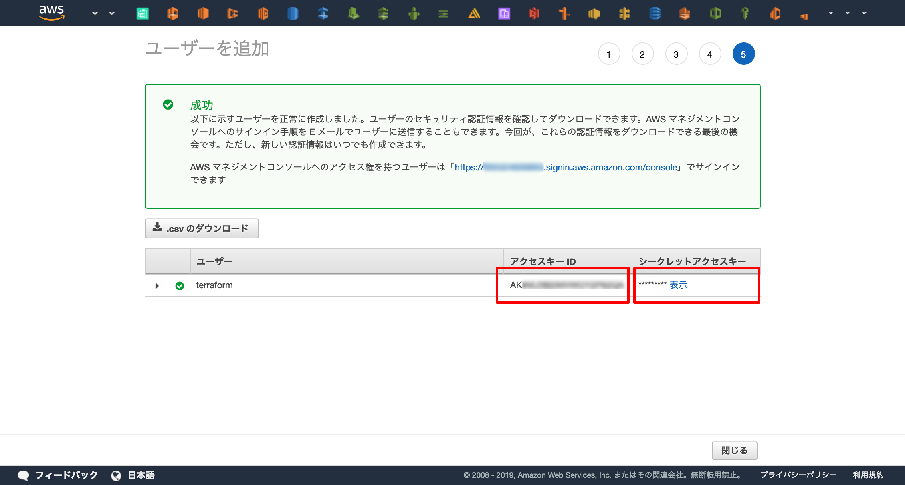

TerraformはCLI上から `terraform` というコマンドを打つことで実行することができます。  
この章では `terraform` コマンドをDocker上で動かすための準備をします。

!!! note "なぜDockerでハンズオンを行うのか"
    Dockerはパッケージングを行うための技術です。  
    サーバーを起動するだけではなく、バージョンの固定や不要なミドルウェアの無いクリーンな環境を用意することが可能です。  
    コンテナ内だけで完結するためホストマシンの環境を汚さずに使用することができます。  
    また、ホストマシン上でterraformを使用したい場合は直接terraformコマンドをインストールせず、バージョン管理が可能なツール(e.g. `tfenv` )を使用してインストールすることを推奨します。


## IAMユーザーの作成
まずはAWSのWebコンソールへアクセスしてTerraform実行用のIAMユーザーを作成し、アクセスキーを取得します。

AWS WebコンソールからIAMサービスへアクセス  


IAMサービスのトップページからユーザー一覧へアクセス。  


「ユーザーを追加」を選択し、IAMユーザーの作成開始。



ユーザー名を「Terraform」に設定し、「プログラムによるアクセス」を有効化。  
「次のステップ:アクセス権限」を押下。


「既存のポリシーを直接アタッチ」を選択し、「AdministratorAccess」ポリシー(管理者権限)を選択。    
「次のステップ:タグ」を押下。


タグは入力せず、そのまま「次のステップ:確認」を押下。


「ユーザーの作成」を押下し、IAMユーザーの作成が完了。  



アクセスキーを取得できるので、他人にもれないように控える。




!!! シークレットキーをgitへ上げないための保険
    commitの内容をスキャンし、AWSアクセスキーが含まれていたらそのcommitをリジェクトしてくれるツールです。  
    保険のためにもAWSを扱うリポジトリでは有効化しておくと良いでしょう。  

    [awslabs/git-secrets: Prevents you from committing secrets and credentials into git repositories](https://github.com/awslabs/git-secrets)

---
## terraformをDockerで起動
まずはディレクトリの作成をしてチェックアウトします。  
Desktopへ"terraform-handson"というディレクトリを作成しますが、気になる方は適宜修正してください。
```console
$ mkdir ~/Desktop/terraform-handson
$ cd ~/Desktop/terraform-handson
```

次に、TerraformをDockerで起動します。  
その際に先程取得したIAMユーザーのアクセスキーとシークレットキーを渡すことでTerraformがAWSのAPIへアクセスできるようになります。  

また、ホストのカレントディレクトリをコンテナ上へマウント( `-v $(pwd):/terraform` )してファイルの共有を行います。  
今後の記述するTerraformのコードはこのディレクトリに配置してコンテナと共有します。

```console
$ docker run \
    -e AWS_ACCESS_KEY_ID=<AWS ACCESS KEY> \
    -e AWS_SECRET_ACCESS_KEY=<AWS SECRET ACCESS KEY> \
    -v $(pwd):/terraform \
    -w /terraform \
    -it \
    --entrypoint=ash \
    hashicorp/terraform:0.11.13
```

これでTerraformの実行環境が手に入りました

最後に、Docker内でTerraformを操作するためのコマンド `terraform` が動くか試してみましょう。
```console
# terraform version
Terraform v0.11.13
```
