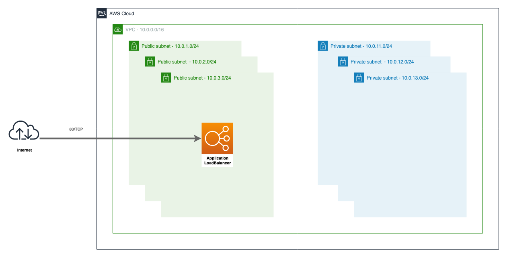
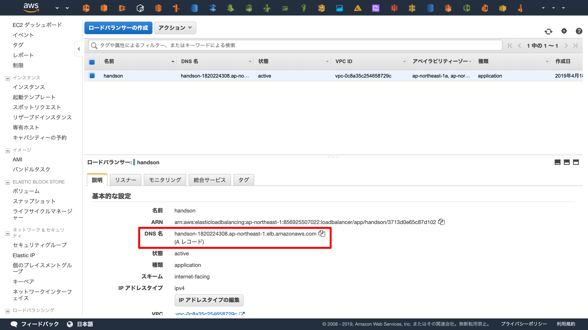
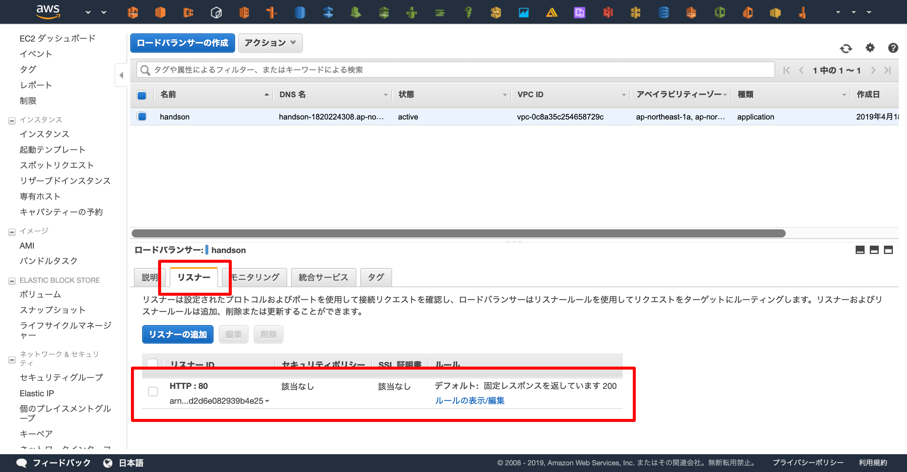

## この章の目標


## ALB


上記の図が目標となる構成です。ネットワークは簡略化しています。  

httpリクエストを受け付けるロードバランサ(ALB)と、そのALBへのhttpリクエストを許可するセキュリティグループを作成します。

```ruby
# SecurityGroup
# https://www.terraform.io/docs/providers/aws/r/security_group.html
resource "aws_security_group" "alb" {
  name        = "handson-alb"
  description = "handson alb"
  vpc_id      = aws_vpc.main.id

  # セキュリティグループ内のリソースからインターネットへのアクセスを許可する
  egress {
    from_port   = 0
    to_port     = 0
    protocol    = "-1"
    cidr_blocks = ["0.0.0.0/0"]
  }

  tags = {
    Name = "handson-alb"
  }
}

# SecurityGroup Rule
# https://www.terraform.io/docs/providers/aws/r/security_group.html
resource "aws_security_group_rule" "alb_http" {
  security_group_id = aws_security_group.alb.id

  # セキュリティグループ内のリソースへインターネットからのアクセスを許可する
  type = "ingress"

  from_port = 80
  to_port   = 80
  protocol  = "tcp"

  cidr_blocks = ["0.0.0.0/0"]
}

# ALB
# https://www.terraform.io/docs/providers/aws/d/lb.html
resource "aws_lb" "main" {
  load_balancer_type = "application"
  name               = "handson"

  security_groups = [aws_security_group.alb.id]
  subnets         = [aws_subnet.public_1a.id, aws_subnet.public_1c.id, aws_subnet.public_1d.id]
}
```

コードの適用を行うとリソースが2つ追加されれば成功です。
```console
# terraform plan
  :
Plan: 3 to add, 0 to change, 0 to destroy.
  :
# terraform apply
  :
```

コンソール上で確認するとALBが起動していて、DNSを確認することが出来ます。


[https://ap-northeast-1.console.aws.amazon.com/ec2/v2/home?region=ap-northeast-1#LoadBalancers:sort=loadBalancerName](https://ap-northeast-1.console.aws.amazon.com/ec2/v2/home?region=ap-northeast-1#LoadBalancers:sort=loadBalancerName)

ただし、この時点ではロードバランサの設定(リスナーの追加)を行っていないためALBにアクセスできません。  
"リスナー" を確認すると設定が1つもないことを確認することができます。


## リスナーの設定
ALBに登録されているDNSへhttpでアクセスすると "ok" の固定レスポンスを返すようにしましょう。  

"ok" を返すためにはALBのリスナーの設定を追加する必要があります。  
Terraformでその設定を追加しましょう。

```ruby
# Listener
# https://www.terraform.io/docs/providers/aws/r/lb_listener.html
resource "aws_lb_listener" "main" {
  # HTTPでのアクセスを受け付ける
  port              = "80"
  protocol          = "HTTP"

  # ALBのarnを指定します。
  #XXX: arnはAmazon Resource Names の略で、その名の通りリソースを特定するための一意な名前(id)です。
  load_balancer_arn = aws_lb.main.arn

  # "ok" という固定レスポンスを設定する
  default_action {
    type             = "fixed-response"

    fixed_response {
      content_type = "text/plain"
      status_code  = "200"
      message_body = "ok"
    }
  }
}
```

コードの適用を行うとリソースが1つ追加されれば成功です。
```console
# terraform plan
  :
Plan: 1 to add, 0 to change, 0 to destroy.
  :
# terraform apply
  :
```

ALBがhttpを受け付けるようになったことを確認します。



ALBのDNSへアクセスし、 "ok" が返ってくることを確認しましょう。


