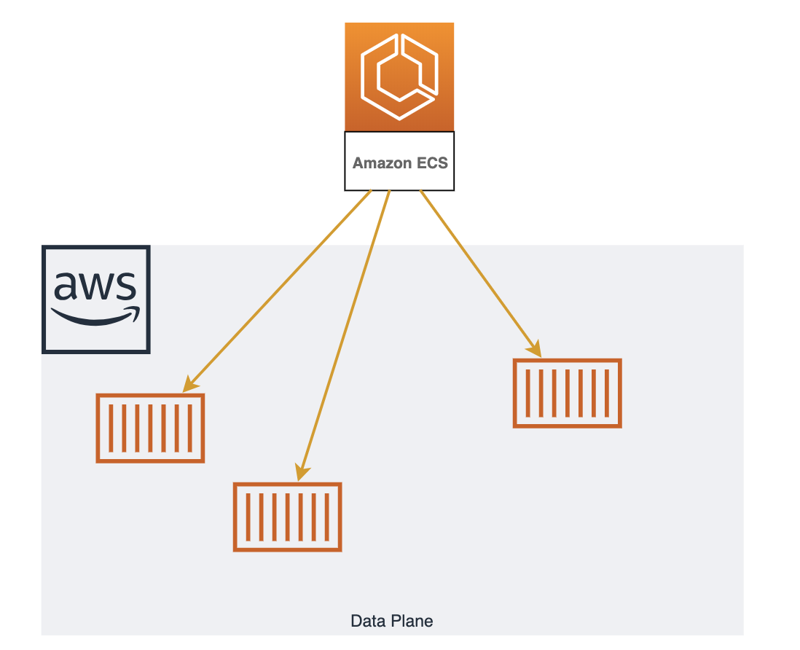
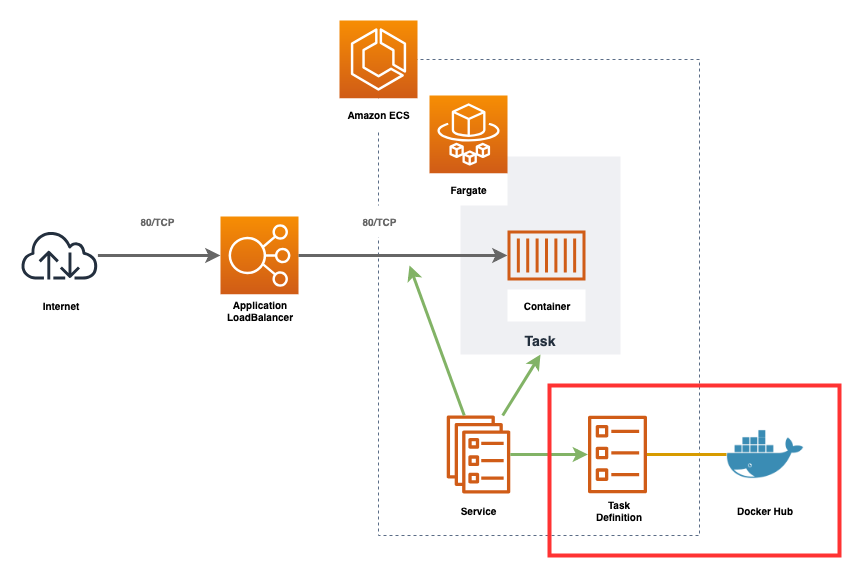
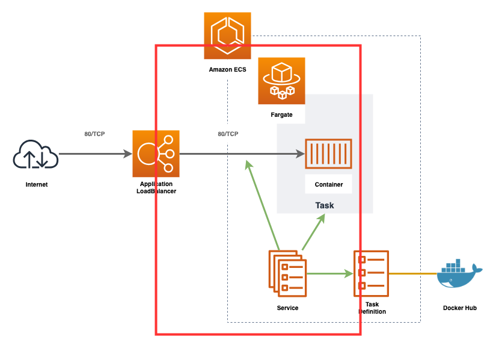

## ECSとは

**"Elastic Container Service"** はAWSが開発したDockerオーケストレーションツールです。  
開発者はコンテナを動かすことに集中できるよう開発されていてクラスターの管理はAWSが行ってくれます。  
そのため、プロダクションで活用するまでの学習コストが低く、他のAWSサービスとの連携もしやすいことが特徴です。

### 構成


ECSは **"コントロールプレーン"** と **"データプレーン"** の2つに別れます。  

データプレーンは1台以上のEC2をリソースプールとして扱うもので、データプレーン上にコンテナは配置されます。  
コントロールプレーンはデータプレーン上へコンテナの配置とその管理を行います。  

基本的に開発者はEC2を立てて、ECSのコンソール上で「どんなコンテナが必要か」定義するだけであとはよしなにコンテナが動きます。  

!!! note "Fargate"
    データプレーンを構成するEC2郡は開発者が管理する必要があります。  
    OS/ライブラリのアップデート/セキュリティパッチや使わなくなったファイルのローテート、リソースが足りなくなった際にスケールさせるなどを行う必要があります。  
    Fargateは **"データプレーンの第二の選択肢"**です。  
    コンテナを動かすリソースプールとして、開発者が管理するEC2郡ではなくAWSがマネージするリソースプールを使用します。  
    これによりEC2の管理から手離れができ学習コスト/運用コストが低くなります。反面、EC2をうまく使った時より利用料は高くなります。  
    基本的にAWSに不慣れな場合はデータプレーンにEC2ではなくFargateを選択したほうが良いでしょう。  
    

### コンテナの管理

ECSでリクエストを受け付けるコンテナを起動する場合、基本的に上記のような構成になります。

ECSを使用する際に重要なのは "タスク定義", "サービス", "タスク"の3つです。

* タスク定義
    - どんなコンテナをどんな設定で動かすかを定義する
* サービス
    - どのタスク定義でコンテナを立ち上げ、そのコンテナとどのロードバランサ(ターゲットグループ, リスナー)と紐付けるか
* タスク
    - タスク定義をもとに起動したコンテナをタスクと呼びます

開発者がECSを使用する際は「タスク定義を作成し、そのタスク定義をもとにサービスを起動」する流れになります。

## タスク定義の作成


nginxを立ち上げるための設定を記述します。  

```ruby
# Task Definition
# https://www.terraform.io/docs/providers/aws/r/ecs_task_definition.html
resource "aws_ecs_task_definition" "main" {
  family = "handson"

  # データプレーンの選択
  requires_compatibilities = ["FARGATE"]

  # ECSタスクが使用可能なリソースの上限
  # タスク内のコンテナはこの上限内に使用するリソースを収める必要があり、メモリが上限に達した場合OOM Killer にタスクがキルされる
  cpu    = "256"
  memory = "512"

  # ECSタスクのネットワークドライバ
  # Fargateを使用する場合は"awsvpc"決め打ち
  network_mode = "awsvpc"

  # 起動するコンテナの定義
  # 「nginxを起動し、80ポートを開放する」設定を記述。
  container_definitions = <<EOL
[
  {
    "name": "nginx",
    "image": "nginx:1.14",
    "portMappings": [
      {
        "containerPort": 80,
        "hostPort": 80
      }
    ]
  }
]
EOL
}
```

コードの適用を行うとリソースが1つ追加されれば成功です。
```console
# terraform plan
  :
Plan: 1 to add, 0 to change, 0 to destroy.
  :
# terraform apply
  :
```

[https://ap-northeast-1.console.aws.amazon.com/ecs/home?region=ap-northeast-1#/taskDefinitions](https://ap-northeast-1.console.aws.amazon.com/ecs/home?region=ap-northeast-1#/taskDefinitions)

## クラスターの作成


ECSクラスターを作成します。  

```ruby
# ECS Cluster
# https://www.terraform.io/docs/providers/aws/r/ecs_cluster.html
resource "aws_ecs_cluster" "main" {
  name = "handson"
}
```

コードの適用を行うとリソースが1つ追加されれば成功です。
```console
# terraform plan
  :
Plan: 1 to add, 0 to change, 0 to destroy.
  :
# terraform apply
  :
```

## サービス


サービスはタスク定義をもとにタスク(コンテナ)を立ち上げ、そのタスクとロードバランサを紐付けるための仕組みです。  

### ロードバランサの設定を追加


まずはサービスとロードバランサを紐付けるための設定を追加しましょう。  
ロードバランサとコンテナの紐付けは"ターゲットグループ"と"リスナー"の2つを使用します。

* ターゲットグループ
    - ヘルスチェックを行う
* リスナー
    - ロードバランサがリクエスト受けた際、どのターゲットグループへリクエストを受け渡すのかの設定

!!! note "LBの種類"
    AWSには "Application LoadBalancer", "Network LoadBalancer", "Classic LoadBalancer" の3つのロードバランサが用意されています。  
    歴史的にはもともとAWSはClassic LoadBalancerの1つしか用意されていませんでしたが、新しい選択肢としてApplication LoadBalancer とNetwork LoadBalancer の2つが登場しました。基本的にCLBは古く、新しいサービスではALBかNLBのどちらかを選択して使用します。  
    ALBとNLBは扱うネットワークのレイヤーが異なります。OSI参照モデルが想像が付きやすいです。ALBはレイヤー7(http/https)レベルでのトラフィックの振り分けが可能で、NLBはL4(TCP)レベルでの振り分けを行います。

コードを記述しましょう。
```ruby
# ELB Target Group
# https://www.terraform.io/docs/providers/aws/r/lb_target_group.html
resource "aws_lb_target_group" "main" {
  name = "handson"

  # ターゲットグループを作成するVPC
  vpc_id = aws_vpc.main.id

  # ALBからECSタスクのコンテナへトラフィックを振り分ける設定
  port        = 80
  protocol    = "HTTP"
  target_type = "ip"

  # コンテナへの死活監視設定
  health_check {
    port = 80
    path = "/"
  }
}

# ALB Listener Rule
# https://www.terraform.io/docs/providers/aws/r/lb_listener_rule.html
resource "aws_lb_listener_rule" "main" {
  # ルールを追加するリスナー
  listener_arn = aws_lb_listener.main.arn

  # 受け取ったトラフィックをターゲットグループへ受け渡す
  action {
    type             = "forward"
    target_group_arn = aws_lb_target_group.main.id
  }

  # ターゲットグループへ受け渡すトラフィックの条件
  condition {
    path_pattern {
      values = ["*"]
    }
  }
}
```

コードの適用を行うとリソースが2つ追加されれば成功です。
```console
# terraform plan
  :
Plan: 2 to add, 0 to change, 0 to destroy.
  :
# terraform apply
  :
```

### サービスの作成


```ruby
# SecurityGroup
# https://www.terraform.io/docs/providers/aws/r/security_group.html
resource "aws_security_group" "ecs" {
  name        = "handson-ecs"
  description = "handson ecs"

  # セキュリティグループを配置するVPC
  vpc_id      = aws_vpc.main.id
  
  # セキュリティグループ内のリソースからインターネットへのアクセス許可設定
  # 今回の場合DockerHubへのPullに使用する。
  egress {
    from_port   = 0
    to_port     = 0
    protocol    = "-1"
    cidr_blocks = ["0.0.0.0/0"]
  }

  tags = {
    Name = "handson-ecs"
  }
}

# SecurityGroup Rule
# https://www.terraform.io/docs/providers/aws/r/security_group.html
resource "aws_security_group_rule" "ecs" {
  security_group_id = aws_security_group.ecs.id

  # インターネットからセキュリティグループ内のリソースへのアクセス許可設定
  type = "ingress"

  # TCPでの80ポートへのアクセスを許可する
  from_port = 80
  to_port   = 80
  protocol  = "tcp"

  # 同一VPC内からのアクセスのみ許可
  cidr_blocks = ["10.0.0.0/16"]
}

# ECS Service
# https://www.terraform.io/docs/providers/aws/r/ecs_service.html
resource "aws_ecs_service" "main" {
  name = "handson"

  # 依存関係の記述。
  # "aws_lb_listener_rule.main" リソースの作成が完了するのを待ってから当該リソースの作成を開始する。
  # "depends_on" は "aws_ecs_service" リソース専用のプロパティではなく、Terraformのシンタックスのため他の"resource"でも使用可能
  depends_on = ["aws_lb_listener_rule.main"]

  # 当該ECSサービスを配置するECSクラスターの指定
  cluster = aws_ecs_cluster.main.name

  # データプレーンとしてFargateを使用する
  launch_type = "FARGATE"

  # ECSタスクの起動数を定義
  desired_count = "1"

  # 起動するECSタスクのタスク定義
  task_definition = aws_ecs_task_definition.main.arn

  # ECSタスクへ設定するネットワークの設定
  network_configuration = {
    # タスクの起動を許可するサブネット
    subnets         = [aws_subnet.private_1a.id, aws_subnet.private_1c.id, aws_subnet.private_1d.id]
    # タスクに紐付けるセキュリティグループ
    security_groups = [aws_security_group.ecs.id]
  }

  # ECSタスクの起動後に紐付けるELBターゲットグループ
  load_balancer = [
    {
      target_group_arn = aws_lb_target_group.main.arn
      container_name   = "nginx"
      container_port   = "80"
    },
  ]
}
```

コードの適用を行います。
```
# terraform plan
# terraform apply
  :
```

ALBのWebコンソールに表示されているDNSへhttpでアクセスし、nginxが表示されれば成功です

[https://ap-northeast-1.console.aws.amazon.com/ec2/v2/home?region=ap-northeast-1#LoadBalancers](https://ap-northeast-1.console.aws.amazon.com/ec2/v2/home?region=ap-northeast-1#LoadBalancer:)


