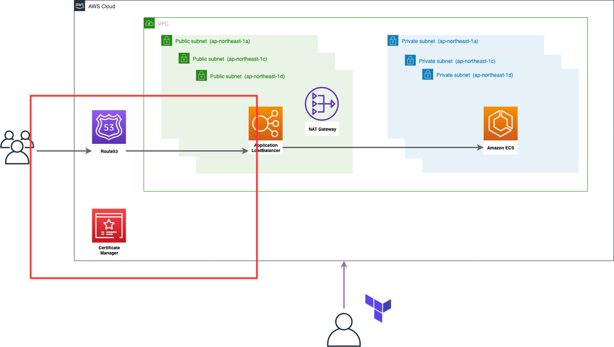

## この章の目標


この章ではALBとドメインの紐付けとhttpsの対応を行います。  
そのため、ドメインが必要になります。

作成するリソースは以下の6つです。

1. AWS Certificate Manager
    - TLS証明書の発行
2. Route 53 CNAMEレコード
    - TLS証明書発行時にドメインの所有を証明するために作成
1. AWS Certificate Manager Validation
    - TLS証明書発行時にドメインの所有を証明するために作成
        - ACMでドメインを使用して所有証明をする場合は基本的にCNAMEレコードとワンセットで定義する。
3. Route 53 Aレコード
    - ALBとドメインの紐付け用レコード
4. セキュリティグループルール
    - 作成済みのALB用セキュリティグループへhttpsも受け付けるようルールを追加する
5. ALB httpリスナー
    - httpリクエスト受けつけ、そのリクエストをhttpsへリダイレクトさせるルール
6. ALB httpsリスナー
    - httpsリクエストを受けつけ、そのリクエストを作成済みのECS(nginx)へ流すルール

## コードの記述
今回は新しく `variable` と `data` の2つのブロックを使用します。

`variable` は変数の定義に使用します。  
複数のブロックで共通して使用する値や、環境(ステージング・本番)毎に依存する値を定義します。

`data` は既存のリソースを参照します。  
基本的に `resource` ではTerraformで管理されていない場合新規に作成します。しかし、既存のリソースを使用したいケースやTerraformで管理したくないリソースは往々にして存在します。そういったリソースの情報をTerraformで管理せず参照するために使用します。

実際にコードを定義していきます。  
`variable` はRoute53で管理しているドメイン名を入力し、 `data` でそのドメインを参照してACMの証明書発行やALBとドメインの紐付けに使用します。

```ruby
variable "domain" {
  description = "Route 53 で管理しているドメイン名"
  type        = "string"

  #FIXME:
  default = "<YOUR DOMAIN NAME>"
}

# Route53 Hosted Zone
# https://www.terraform.io/docs/providers/aws/d/route53_zone.html
data "aws_route53_zone" "main" {
  name         = "${var.domain}"
  private_zone = false
}

# ACM
# https://www.terraform.io/docs/providers/aws/r/acm_certificate.html
resource "aws_acm_certificate" "main" {
  domain_name = "${var.domain}"

  validation_method = "DNS"

  lifecycle {
    create_before_destroy = true
  }
}

# Route53 record
# https://www.terraform.io/docs/providers/aws/r/route53_record.html
resource "aws_route53_record" "validation" {
  depends_on = ["aws_acm_certificate.main"]

  zone_id = "${data.aws_route53_zone.main.id}"

  ttl = 60

  name    = "${aws_acm_certificate.main.domain_validation_options.0.resource_record_name}"
  type    = "${aws_acm_certificate.main.domain_validation_options.0.resource_record_type}"
  records = ["${aws_acm_certificate.main.domain_validation_options.0.resource_record_value}"]
}

# ACM Validate
# https://www.terraform.io/docs/providers/aws/r/acm_certificate_validation.html
resource "aws_acm_certificate_validation" "main" {
  certificate_arn = "${aws_acm_certificate.main.arn}"

  validation_record_fqdns = ["${aws_route53_record.validation.0.fqdn}"]
}

# Route53 record
# https://www.terraform.io/docs/providers/aws/r/route53_record.html
resource "aws_route53_record" "main" {
  type = "A"

  name    = "${var.domain}"
  zone_id = "${data.aws_route53_zone.main.id}"

  alias = {
    name                   = "${aws_lb.main.dns_name}"
    zone_id                = "${aws_lb.main.zone_id}"
    evaluate_target_health = true
  }
}

# ALB Listener
# https://www.terraform.io/docs/providers/aws/r/lb_listener.html
resource "aws_lb_listener" "https" {
  load_balancer_arn = "${aws_lb.main.arn}"

  certificate_arn = "${aws_acm_certificate.main.arn}"

  port     = "443"
  protocol = "HTTPS"

  default_action {
    type             = "forward"
    target_group_arn = "${aws_lb_target_group.main.id}"
  }
}

# ALB Listener Rule
# https://www.terraform.io/docs/providers/aws/r/lb_listener_rule.html
resource "aws_lb_listener_rule" "http_to_https" {
  listener_arn = "${aws_lb_listener.main.arn}"

  priority = 99

  action {
    type = "redirect"

    redirect {
      port        = "443"
      protocol    = "HTTPS"
      status_code = "HTTP_301"
    }
  }

  condition {
    field  = "host-header"
    values = ["${var.domain}"]
  }
}

# Security Group Rule
# https://www.terraform.io/docs/providers/aws/r/security_group_rule.html
resource "aws_security_group_rule" "alb_https" {
  security_group_id = "${aws_security_group.alb.id}"

  type = "ingress"

  from_port = 443
  to_port   = 443
  protocol  = "tcp"

  cidr_blocks = ["0.0.0.0/0"]
}
```

コードの適用を行います。
```
# terraform plan
# terraform apply
  :
```

実際に登録したドメインへhttpでアクセスし、httpsへリダイレクトされ、nginxが表示されれば成功です。

## 片付け
満足したらリソースを削除しましょう。

```
# terraform destroy
```
