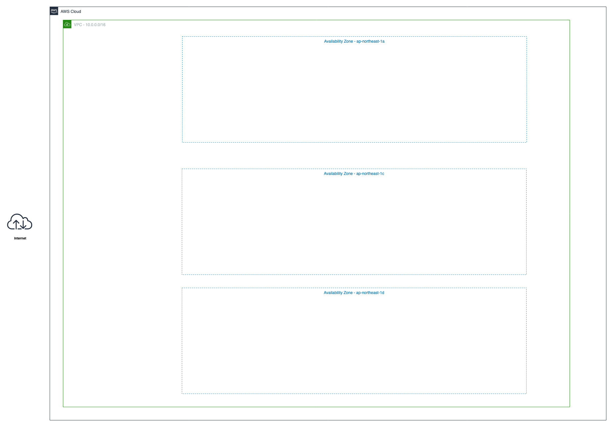
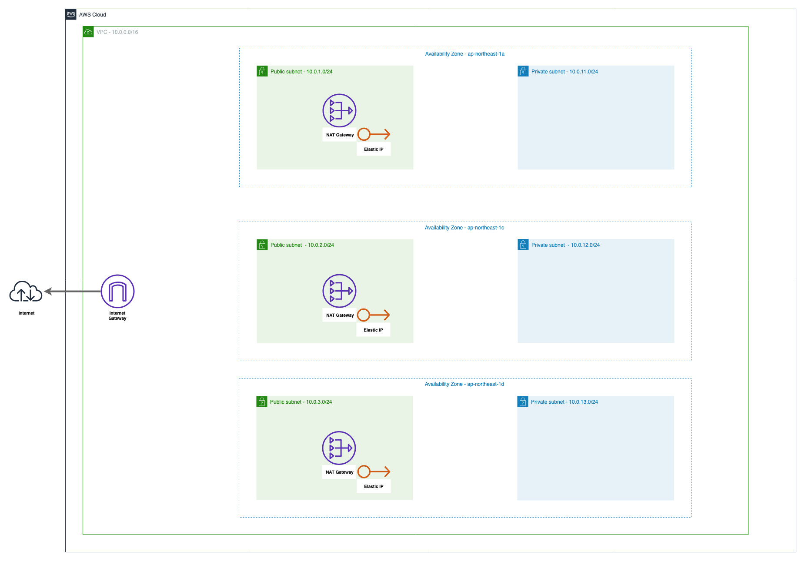
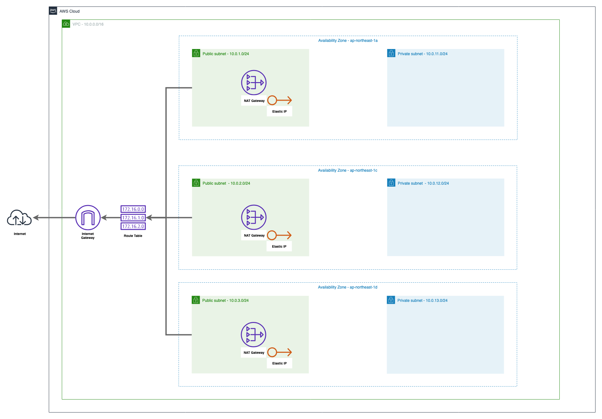
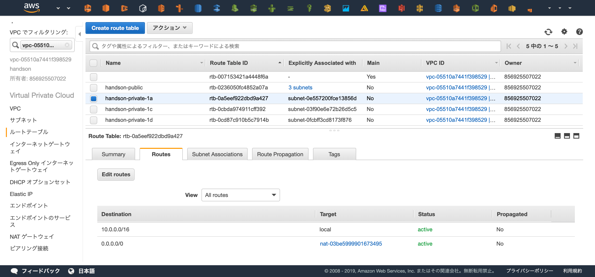

## この章の目標


この章では上記の図の通りのVPCリソースを構築します。  
3つのAvailability Zone で設計したときのネットワークが目標です。

Terraformで実際に記述していきましょう。

## 準備
新しいTerminalを立ち上げ、以下のコマンドでこの章用のディレクトリを作成し、作成したディレクトリに移動してください。  
```console
$ cd ~/Desktop/terraform-handson
$ mkdir handson
$ cd handson
```

Terraformを立ち上げているTerminalにもディレクトリが作成されていることを確認し、共有されたディレクトリに移動してください。
```console
# cd /terraform
# ls
handson     vpc-handson
# cd handson
```

プロバイダの定義を行います。今回もAWSを使用するので、"aws"と指定します。  
以下のコードを `main.tf` の命名で `handson/` 配下に作成してください。
```ruby
provider "aws" {
  region = "ap-northeast-1"
}
```

terraformの初期化を行います。

```console
# terraform init

Initializing provider plugins...
- Checking for available provider plugins on https://releases.hashicorp.com...
- Downloading plugin for provider "aws" (2.6.0)...

The following providers do not have any version constraints in configuration,
so the latest version was installed.

To prevent automatic upgrades to new major versions that may contain breaking
changes, it is recommended to add version = "..." constraints to the
corresponding provider blocks in configuration, with the constraint strings
suggested below.

* provider.aws: version = "~> 2.6"

Terraform has been successfully initialized!

You may now begin working with Terraform. Try running "terraform plan" to see
any changes that are required for your infrastructure. All Terraform commands
should now work.

If you ever set or change modules or backend configuration for Terraform,
rerun this command to reinitialize your working directory. If you forget, other
commands will detect it and remind you to do so if necessary.
```

## VPC

まずは今回使用するVPCの作成を行います。

以下のコードを `main.tf` へ追記してください
```ruby
# VPC
# https://www.terraform.io/docs/providers/aws/r/vpc.html
resource "aws_vpc" "main" {
  cidr_block = "10.0.0.0/16"

  tags = {
    Name = "handson"
  }
}
```

コードの追記が追えたらplanを行ってから適用を行います。
```console
# terraform plan
terraform plan
Refreshing Terraform state in-memory prior to plan...
The refreshed state will be used to calculate this plan, but will not be
persisted to local or remote state storage.


------------------------------------------------------------------------

An execution plan has been generated and is shown below.
Resource actions are indicated with the following symbols:
  + create

Terraform will perform the following actions:

  + aws_vpc.main
      id:                               <computed>
      arn:                              <computed>
      assign_generated_ipv6_cidr_block: "false"
      cidr_block:                       "10.0.0.0/16"
      default_network_acl_id:           <computed>
      default_route_table_id:           <computed>
      default_security_group_id:        <computed>
      dhcp_options_id:                  <computed>
      enable_classiclink:               <computed>
      enable_classiclink_dns_support:   <computed>
      enable_dns_hostnames:             <computed>
      enable_dns_support:               "true"
      instance_tenancy:                 "default"
      ipv6_association_id:              <computed>
      ipv6_cidr_block:                  <computed>
      main_route_table_id:              <computed>
      owner_id:                         <computed>
      tags.%:                           "1"
      tags.Name:                        "handson"


Plan: 1 to add, 0 to change, 0 to destroy.

------------------------------------------------------------------------

Note: You didn't specify an "-out" parameter to save this plan, so Terraform
can't guarantee that exactly these actions will be performed if
"terraform apply" is subsequently run.
```
```console
# terraform apply
  :
```

実際にVPCが作成されたかの確認をしましょう。


[https://ap-northeast-1.console.aws.amazon.com/vpc/home?region=ap-northeast-1#vpcs:sort=desc:VpcId](https://ap-northeast-1.console.aws.amazon.com/vpc/home?region=ap-northeast-1#vpcs:sort=desc:VpcId)

## Subnet

次にサブネットを6つ作成します。  
Public SubnetとPrivate Subnetの2種類と、ap-northeast-1リージョン(東京リージョン)に存在する3つのAZへ各種リソース(EC2やECSやRDSなど)を配置したいため、2*3で計6つのサブネットを作成します。

まずは「"handson-public-1a"という命名でap-northeast-1aにCIDRが10.0.1.0/24のサブネット」を作成してみましょう
```ruby
# Subnet
# https://www.terraform.io/docs/providers/aws/r/subnet.html
resource "aws_subnet" "public_1a" {
  # 先程作成したVPCを参照し、そのVPC内にSubnetを立てる
  vpc_id = "${aws_vpc.main.id}"

  # Subnetを作成するAZ
  availability_zone = "ap-northeast-1a"

  cidr_block        = "10.0.1.0/24"

  tags = {
    Name = "handson-public-1a"
  }
}
```

planを実行し、Subnetが作成されることを確認しましょう。
```console
# terraform plan
Refreshing Terraform state in-memory prior to plan...
The refreshed state will be used to calculate this plan, but will not be
persisted to local or remote state storage.

aws_vpc.main: Refreshing state... (ID: vpc-0396987ded1c4fd87)

------------------------------------------------------------------------

An execution plan has been generated and is shown below.
Resource actions are indicated with the following symbols:
  + create

Terraform will perform the following actions:

  + aws_subnet.public_1a
      id:                              <computed>
      arn:                             <computed>
      assign_ipv6_address_on_creation: "false"
      availability_zone:               "ap-northeast-1a"
      availability_zone_id:            <computed>
      cidr_block:                      "10.0.1.0/24"
      ipv6_cidr_block:                 <computed>
      ipv6_cidr_block_association_id:  <computed>
      map_public_ip_on_launch:         "false"
      owner_id:                        <computed>
      tags.%:                          "1"
      tags.Name:                       "handson-public-1a"
      vpc_id:                          "vpc-0396987ded1c4fd87"


Plan: 1 to add, 0 to change, 0 to destroy.

------------------------------------------------------------------------

Note: You didn't specify an "-out" parameter to save this plan, so Terraform
can't guarantee that exactly these actions will be performed if
"terraform apply" is subsequently run.
```

問題なければapplyを実行してSubnetの作成を行います。
```console
# terraform apply
  :
```

以下のコードを追記して、残り5つのサブネットも作成します。  
リソース名（e.g. "publi\_1c", "public\_1d"）と各種プロパティが少しずつことなるので注意してください。
```ruby
resource "aws_subnet" "public_1c" {
  vpc_id = "${aws_vpc.main.id}"

  availability_zone = "ap-northeast-1c"

  cidr_block        = "10.0.2.0/24"

  tags = {
    Name = "handson-public-1c"
  }
}

resource "aws_subnet" "public_1d" {
  vpc_id = "${aws_vpc.main.id}"

  availability_zone = "ap-northeast-1d"

  cidr_block        = "10.0.3.0/24"

  tags = {
    Name = "handson-public-1d"
  }
}

# Private Subnets
resource "aws_subnet" "private_1a" {
  vpc_id = "${aws_vpc.main.id}"

  availability_zone = "ap-northeast-1a"
  cidr_block        = "10.0.10.0/24"

  tags = {
    Name = "handson-private-1a"
  }
}

resource "aws_subnet" "private_1c" {
  vpc_id = "${aws_vpc.main.id}"

  availability_zone = "ap-northeast-1c"
  cidr_block        = "10.0.20.0/24"

  tags = {
    Name = "handson-private-1c"
  }
}

resource "aws_subnet" "private_1d" {
  vpc_id = "${aws_vpc.main.id}"

  availability_zone = "ap-northeast-1d"
  cidr_block        = "10.0.30.0/24"

  tags = {
    Name = "handson-private-1d"
  }
}
```

planを実行し、5つの新しいリソースが追加されることを確認しましょう。
```console
# terraform plan
  :
Plan: 5 to add, 0 to change, 0 to destroy.
```

問題なければapplyを実行してSubnetの作成を行います。
```console
# terraform apply
```

WebコンソールからSubnetが6つ作成されていることを確認しましょう。  
サイドバーのVPCでフィルタリングで先程Terraformから作成した "handson" というVPCを選択すると分かりやすいです。


[https://ap-northeast-1.console.aws.amazon.com/vpc/home?region=ap-northeast-1#subnets:sort=tag:Name](https://ap-northeast-1.console.aws.amazon.com/vpc/home?region=ap-northeast-1#subnets:sort=tag:Name)

## Internet Gateway

VPCからインターネットへの出入り口となるInternet Gatewayを作成しましょう。  
コンソール上から作成するとInternet Gateway とVPCは自動で紐付きませんが、Terraformの場合プロパティでVPCを指定することで自動的に紐づけてくれます。

```ruby
# Internet Gateway
# https://www.terraform.io/docs/providers/aws/r/internet_gateway.html
resource "aws_internet_gateway" "main" {
  vpc_id = "${aws_vpc.main.id}"

  tags = {
    Name = "handson"
  }
}
```

planを実行し、1つのリソースが追加されていることを確認します。
```console
# terraform plan
Plan: 1 to add, 0 to change, 0 to destroy.
```

問題なければapplyを実行します。
```console
# terraform apply
```

## NAT Gateway

プライベートサブネットからインターネットへ通信するためにNAT Gatewayを使用します。  
NAT Gatewayは1つのElastic IPが必要なのでその割り当てと、AZ毎に必要なので3つ作成します。

まずはap-northeast-1a用のNAT Gatewayを1つ作成してみましょう
```ruby
# Elasti IP
# https://www.terraform.io/docs/providers/aws/r/eip.html
resource "aws_eip" "nat_1a" {
  vpc = true

  tags = {
    Name = "handson-natgw-1a"
  }
}

# NAT Gateway
# https://www.terraform.io/docs/providers/aws/r/nat_gateway.html
resource "aws_nat_gateway" "nat_1a" {
  subnet_id     = "${aws_subnet.public_1a.id}" # NAT Gatewayを配置するSubnetを指定
  allocation_id = "${aws_eip.nat_1a.id}"       # 紐付けるElasti IP

  tags = {
    Name = "handson-1a"
  }
}
```

planで変更確認を行います。
```console
# terraform plan
Refreshing Terraform state in-memory prior to plan...
The refreshed state will be used to calculate this plan, but will not be
persisted to local or remote state storage.

aws_vpc.main: Refreshing state... (ID: vpc-0396987ded1c4fd87)
aws_subnet.public_1d: Refreshing state... (ID: subnet-0f8eb38d6429200be)
aws_internet_gateway.main: Refreshing state... (ID: igw-0e46a72941683c00f)
aws_subnet.private_1a: Refreshing state... (ID: subnet-0b4e88abdc1cf586a)
aws_subnet.private_1d: Refreshing state... (ID: subnet-0910f1d541d1ad52d)
aws_subnet.private_1c: Refreshing state... (ID: subnet-01e1173f6b8ed56d5)
aws_subnet.public_1c: Refreshing state... (ID: subnet-0519598224db34049)
aws_subnet.public_1a: Refreshing state... (ID: subnet-08b90fd31e5d8dec4)

------------------------------------------------------------------------

An execution plan has been generated and is shown below.
Resource actions are indicated with the following symbols:
  + create

Terraform will perform the following actions:

  + aws_eip.nat_1a
      id:                   <computed>
      allocation_id:        <computed>
      association_id:       <computed>
      domain:               <computed>
      instance:             <computed>
      network_interface:    <computed>
      private_dns:          <computed>
      private_ip:           <computed>
      public_dns:           <computed>
      public_ip:            <computed>
      public_ipv4_pool:     <computed>
      tags.%:               "1"
      tags.Name:            "handson-natgw-1a"
      vpc:                  "true"

  + aws_nat_gateway.nat_1a
      id:                   <computed>
      allocation_id:        "${aws_eip.nat_1a.id}"
      network_interface_id: <computed>
      private_ip:           <computed>
      public_ip:            <computed>
      subnet_id:            "subnet-08b90fd31e5d8dec4"


Plan: 2 to add, 0 to change, 0 to destroy.

------------------------------------------------------------------------

Note: You didn't specify an "-out" parameter to save this plan, so Terraform
can't guarantee that exactly these actions will be performed if
"terraform apply" is subsequently run.
```

Elastic IP とNAT Gateway の2つが作成されることが確認できました。

applyを実行します。
```console
# terraform apply
```

残り2つのNAT Gatewayも作成して適用しましょう
```ruby
resource "aws_eip" "nat_1c" {
  vpc = true

  tags = {
    Name = "handson-natgw-1c"
  }
}

resource "aws_nat_gateway" "nat_1c" {
  subnet_id     = "${aws_subnet.public_1c.id}"
  allocation_id = "${aws_eip.nat_1c.id}"

  tags = {
    Name = "handson-1c"
  }
}

resource "aws_eip" "nat_1d" {
  vpc = true

  tags = {
    Name = "handson-natgw-1d"
  }
}

resource "aws_nat_gateway" "nat_1d" {
  subnet_id     = "${aws_subnet.public_1d.id}"
  allocation_id = "${aws_eip.nat_1d.id}"

  tags = {
    Name = "handson-1d"
  }
}
```

```console
# terraform plan
  :
Plan: 6 to add, 0 to change, 0 to destroy.
  :
# terraform apply
  :
```

## Route Table
最後に、トラフィックを疎通させるための経路設定を行います。  
Internet Gatewayを使用してインターネットへ疎通するためのRoute Table/Routes と NAT Gatewayを経由してインターネットへ疎通するためのRoute Table/Routes を設定します。  

!!! note "Subnetの呼び分け"
    Internet Gatewayと直接的な経路が存在するSubnetを"Public Subnet"と呼び、  
    インターネットへの経路が存在しない・NAT Gatewayを使用してインターネットへ接続しているSubnetを"Private Subnet" と呼びます



まずはInternet GatewayとSubnetの経路を作成しましょう。  
少し多いので解説すると、作成するのは以下の3種類のリソースです。

1. "aws\_route\_table"
    - 経路情報の格納
2. "aws\_route"
    - Route Tableへ経路情報を追加
    - インターネット(0.0.0.0/0)へ接続する際はInternet Gatewayを使用するように設定する
3. "aws\_route\_table\_association"
    - Route TableとSubnetの紐づけ

```ruby
# Route Table
# https://www.terraform.io/docs/providers/aws/r/route_table.html
resource "aws_route_table" "public" {
  vpc_id = "${aws_vpc.main.id}"

  tags = {
    Name = "handson-public"
  }
}

# Route
# https://www.terraform.io/docs/providers/aws/r/route.html
resource "aws_route" "public" {
  destination_cidr_block = "0.0.0.0/0"
  route_table_id         = "${aws_route_table.public.id}"
  gateway_id             = "${aws_internet_gateway.main.id}"
}

# Association
# https://www.terraform.io/docs/providers/aws/r/route_table_association.html
resource "aws_route_table_association" "public_1a" {
  subnet_id      = "${aws_subnet.public_1a.id}"
  route_table_id = "${aws_route_table.public.id}"
}

resource "aws_route_table_association" "public_1c" {
  subnet_id      = "${aws_subnet.public_1c.id}"
  route_table_id = "${aws_route_table.public.id}"
}

resource "aws_route_table_association" "public_1d" {
  subnet_id      = "${aws_subnet.public_1d.id}"
  route_table_id = "${aws_route_table.public.id}"
}
```

```console
# terraform plan
  :
Plan: 5 to add, 0 to change, 0 to destroy.
  :
# terraform apply
  :
```


NAT GatewayとSubnetの経路を作成しましょう。  
Internet Gateway との違いとしては各AZにNAT Gateway が必要になる点です。

```ruby
# Route Table (Private)
# https://www.terraform.io/docs/providers/aws/r/route_table.html
resource "aws_route_table" "private_1a" {
  vpc_id = "${aws_vpc.main.id}"

  tags = {
    Name = "handson-private-1a"
  }
}

resource "aws_route_table" "private_1c" {
  vpc_id = "${aws_vpc.main.id}"

  tags = {
    Name = "handson-private-1c"
  }
}

resource "aws_route_table" "private_1d" {
  vpc_id = "${aws_vpc.main.id}"

  tags = {
    Name = "handson-private-1d"
  }
}

# Route (Private)
# https://www.terraform.io/docs/providers/aws/r/route.html
resource "aws_route" "private_1a" {
  destination_cidr_block = "0.0.0.0/0"
  route_table_id         = "${aws_route_table.private_1a.id}"
  nat_gateway_id         = "${aws_nat_gateway.nat_1a.id}"
}

resource "aws_route" "private_1c" {
  destination_cidr_block = "0.0.0.0/0"
  route_table_id         = "${aws_route_table.private_1c.id}"
  nat_gateway_id         = "${aws_nat_gateway.nat_1c.id}"
}

resource "aws_route" "private_1d" {
  destination_cidr_block = "0.0.0.0/0"
  route_table_id         = "${aws_route_table.private_1d.id}"
  nat_gateway_id         = "${aws_nat_gateway.nat_1d.id}"
}

# Association (Private)
# https://www.terraform.io/docs/providers/aws/r/route_table_association.html
resource "aws_route_table_association" "private_1a" {
  subnet_id      = "${aws_subnet.private_1a.id}"
  route_table_id = "${aws_route_table.private_1a.id}"
}

resource "aws_route_table_association" "private_1c" {
  subnet_id      = "${aws_subnet.private_1c.id}"
  route_table_id = "${aws_route_table.private_1c.id}"
}

resource "aws_route_table_association" "private_1d" {
  subnet_id      = "${aws_subnet.private_1d.id}"
  route_table_id = "${aws_route_table.private_1d.id}"
}
```

```console
# terraform plan
  :
Plan: 9 to add, 0 to change, 0 to destroy.
  :
# terraform apply
  :
```

経路設定が行えているかWebコンソール上から確認してみましょう。  

確認ポイント

> 1. "handson-" という名前からはじまるRoute Tableが4つあるか
> 2. "handson-public" に3つSubnetが登録されているか
> 3. "handson-public" に登録されているSubnetはPublic Subnetの命名になっているか
> 4. "handson-public" の0.0.0.0への経路はInternet Gatewayを使用しているか
> 5. "handson-private-*" は3つ存在し、それぞれ1つずつSubnetを持っているか
> 6. "handson-private-*" は0.0.0.0への経路はNAT Gatewayを使用しているか


[https://ap-northeast-1.console.aws.amazon.com/vpc/home?region=ap-northeast-1#RouteTables:sort=routeTableId](https://ap-northeast-1.console.aws.amazon.com/vpc/home?region=ap-northeast-1#RouteTables:sort=routeTableId)

ここまでで基礎となるネットワークリソースの作成は完了です！  
