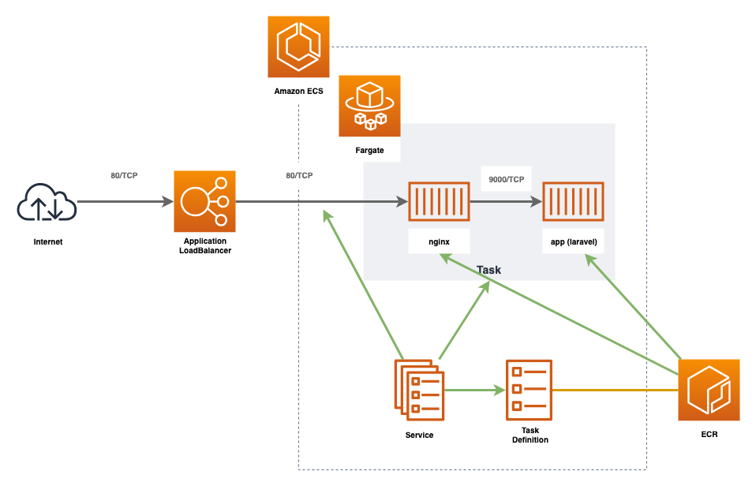
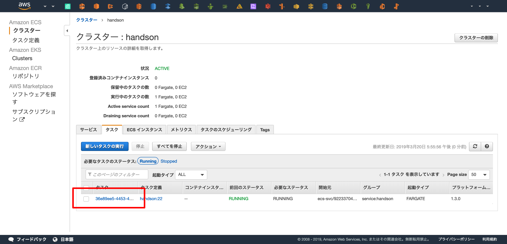
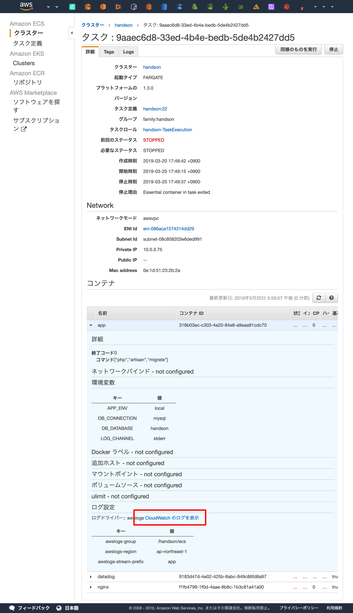

## この章の目標


この章ではLaravelの起動を目標にします

## リソース
- ECS Service
- Task Definition
- IAM Role
- Cloud Watch Log Group
- Security Group

## コード
長くなりますが、コードを記載します。


`./ecs_laravel/`
```ruby
variable "name" {
  type = "string"
}

variable "vpc_id" {
  type = "string"
}

variable "https_listener_arn" {
  type = "string"
}

variable "cluster_name" {
  type = "string"
}

variable "subnet_ids" {
  type = "list"
}

variable "db_host" {
  type = "string"
}

variable "db_username" {
  type = "string"
}

variable "db_password" {
  type = "string"
}

variable "db_database" {
  type = "string"
}

variable "app_key" {
  type = "string"
}

data "aws_region" "current" {}

data "aws_caller_identity" "current" {}

locals {
  name = "${var.name}-laravel"

  # アカウントID
  account_id = "${data.aws_caller_identity.current.account_id}"

  # プロビジョニングを実行するリージョン
  region = "${data.aws_region.current.name}"
}

resource "aws_lb_target_group" "this" {
  name = "${local.name}"

  vpc_id = "${var.vpc_id}"

  port        = 80
  target_type = "ip"
  protocol    = "HTTP"

  health_check = {
    port = 80
  }
}

data "template_file" "container_definitions" {
  template = "${file("./ecs_laravel/container_definitions.json")}"

  vars = {
    tag = "latest"

    account_id = "${local.account_id}"
    region     = "${local.region}"
    name       = "${local.name}"

    db_host     = "${var.db_host}"
    db_username = "${var.db_username}"
    db_password = "${var.db_password}"
    db_database = "${var.db_database}"

    app_key = "${var.app_key}"
  }
}

resource "aws_ecs_task_definition" "this" {
  family = "${local.name}"

  container_definitions = "${data.template_file.container_definitions.rendered}"

  cpu                      = "256"
  memory                   = "512"
  network_mode             = "awsvpc"
  requires_compatibilities = ["FARGATE"]

  task_role_arn      = "${aws_iam_role.task_execution.arn}"
  execution_role_arn = "${aws_iam_role.task_execution.arn}"
}

resource "aws_cloudwatch_log_group" "this" {
  name              = "/${var.name}/ecs"
  retention_in_days = "7"
}

resource "aws_iam_role" "task_execution" {
  name = "${var.name}-TaskExecution"

  assume_role_policy = <<EOF
{
  "Version": "2012-10-17",
  "Statement": [
    {
      "Action": "sts:AssumeRole",
      "Principal": {
        "Service": "ecs-tasks.amazonaws.com"
      },
      "Effect": "Allow",
      "Sid": ""
    }
  ]
}
EOF
}

resource "aws_iam_role_policy" "task_execution" {
  role = "${aws_iam_role.task_execution.id}"

  policy = <<EOF
{
  "Version": "2012-10-17",
  "Statement": [
    {
      "Action": [
        "logs:CreateLogGroup",
        "logs:CreateLogStream",
        "logs:PutLogEvents",
        "logs:DescribeLogGroups",
        "logs:DescribeLogStreams"
      ],
      "Effect": "Allow",
      "Resource": "*"
    }
  ]
}
EOF
}

resource "aws_iam_role_policy_attachment" "task_execution" {
  role       = "${aws_iam_role.task_execution.name}"
  policy_arn = "arn:aws:iam::aws:policy/service-role/AmazonECSTaskExecutionRolePolicy"
}

resource "aws_lb_listener_rule" "this" {
  listener_arn = "${var.https_listener_arn}"

  action {
    type             = "forward"
    target_group_arn = "${aws_lb_target_group.this.id}"
  }

  condition {
    field  = "path-pattern"
    values = ["*"]
  }
}

resource "aws_security_group" "this" {
  name        = "${local.name}"
  description = "${local.name}"

  vpc_id = "${var.vpc_id}"

  egress {
    from_port   = 0
    to_port     = 0
    protocol    = "-1"
    cidr_blocks = ["0.0.0.0/0"]
  }

  tags = {
    Name = "${local.name}"
  }
}

resource "aws_security_group_rule" "this_http" {
  security_group_id = "${aws_security_group.this.id}"

  type = "ingress"

  from_port   = 80
  to_port     = 80
  protocol    = "tcp"
  cidr_blocks = ["0.0.0.0/0"]
}

resource "aws_ecs_service" "this" {
  depends_on = ["aws_lb_listener_rule.this"]

  name = "${local.name}"

  launch_type = "FARGATE"

  desired_count = 1

  cluster = "${var.cluster_name}"

  task_definition = "${aws_ecs_task_definition.this.arn}"

  network_configuration = {
    subnets         = ["${var.subnet_ids}"]
    security_groups = ["${aws_security_group.this.id}"]
  }

  load_balancer = [
    {
      target_group_arn = "${aws_lb_target_group.this.arn}"
      container_name   = "nginx"
      container_port   = "80"
    },
  ]
}
```

## 動作確認
実際にドメインにアクセスし、Laravelの画面が表示されれば成功です

## DBへのmigration

ハンズオンでのワンオフの実行なので、GUIからコマンドを実行します。  
実際にプロダクションで行う際にはスクリプトやパイプラインの中に組み込むのが良いですが、migrationを本当に自動的に実行して良いのかはプロダクションによって変わります。プロダクトの性質によってmigrationの方法は選択しましょう。

ECSコンソールに入り、起動中のタスクを選択します。  



「同様のものを実行」で起動中のタスクを元に新しいタスクを実行します。


`php artisan migrate` を実行するために、以下の設定を行います。  

1. 起動タイプ: FARGATE
2. クラスターVPC: <ハンズオンで作成したVPC>
3. サブネット: <ハンズオンで作成した **プライベートサブネット** >
4. セキュリティーグループ: <ハンズオンで作成した **ECS Service用のセキュリティーグループ** >
5. パブリックIPの自動割り当て: DISABLE
6. コンテナの上書き
    - コマンドの上書き: `php,artisan,migrate,--force`

入力後、「タスクの実行」を押下します。


migration結果の確認




## 動作確認
```console
$ curl <YOUR DNS NAME>/api/books
[]
$ curl -X POST <YOUR DNS NAME>/api/books
{
    "title": "tmp title",
    "updated_at": "2019-03-20 09:34:00",
    "created_at": "2019-03-20 09:34:00",
    "id": 1
}
$ curl -X POST <YOUR DNS NAME>/api/books
{
    "title": "tmp title",
    "updated_at": "2019-03-20 09:34:00",
    "created_at": "2019-03-20 09:34:00",
    "id": 2
}
$ curl <YOUR DNS NAME>/api/books
[
    {
        "id": 1,
        "title": "tmp title",
        "created_at": "2019-03-20 09:33:53",
        "updated_at": "2019-03-20 09:33:53"
    },
    {
        "id": 2,
        "title": "tmp title",
        "created_at": "2019-03-20 09:34:00",
        "updated_at": "2019-03-20 09:34:00"
    }
]
```
